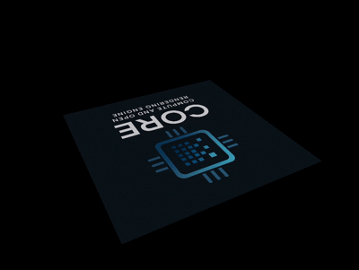

# CORE: Compute and Open Rendering Engine

**CORE** is a cross-platform C++ framework that abstracts away the boilerplate of modern GPU setup, letting developers focus on what matters. It combines high-performance GPU computing with powerful real-time rendering capabilities, offering a clean, unified interface for both compute workloads and graphics pipelines.

<p align="center">
  
</p>

# Table of Content
- [1. Graphics and Compute APIs](#1-graphics-and-compute-apis)
- [2. Supporting OS](#2-supporting-os)
- [3. Compile](#3-compile)
  - [3.1 Prerequisites](#31-prerequisites)
  - [3.2 Host(MacOS) + Target(MacOS)](#32-hostmacos--targetmacos)
  - [3.3 Host(MacOS) + Target(Android arm64-v8a)](#33-hostmacos--targetandroid-arm64-v8a)
- [4. Examples](#4-examples)
- [5. Unit Test](#5-unit-test)
- [6. Compute](#6-compute)
- [7. Graphics](#6-graphics)

# 1. Graphics and Compute APIs

- [x] Vulkan
- [x] OpenGL
- [x] Metal
- [x] OpenCL
- [ ] OpenGLES (WIP)

# 2. Supporting OS

- [x] MacOS
- [x] Android arm64-v8a
- [ ] Windows (WIP, I am trying to get a windows laptop)
- [ ] Linux (WIP, I am trying to get a linux laptop)

# 3. Compile

## 3.1 Prerequisites

1. Download Vulkan from: https://vulkan.lunarg.com/. Select your OS and follow the install instructions.
2. Download Android NDK from: https://github.com/android/ndk/releases?page=1. Select your the NDK version that matches your OS(macos/windows/linux).

After downloading the NDK, set the environment variable **ANDROID_NDK_ROOT** pointing to your NDK directory. For example:
```
export ANDROID_NDK_ROOT=<path_to_ndk>/26.1.10909125
```

## 3.2 Host(MacOS) + Target(MacOS)
```
./run.sh -target macos
```

## 3.3 Host(MacOS) + Target(Android arm64-v8a)
```
./run.sh -target arm64-v8a
``` 

# 4. Examples

There are many examples under the `examples/` folder. If you build with command `./run.sh -target macos`, all the examples should be built under `./build/macos/examples/` folder. Execute them from the root directory.

```
./build/macos/examples/gl_light_demo
```

# 5. Unit Test

All unit tests are under `./tests` folder. To run a specific test:
```
./run.sh -target macos -test_module tests -test_filter MatTest3.test
```

If **-test_filter** is not specified, all the tests will be run.

# 6. Compute
```
./run.sh [-target macos|arm64-v8a] [-test_module <name>] [-test_filter <Suite.Test>]
```

## Vulkan:
For MacOS:
- ./run.sh -target macos -test_module vulkan -test_filter ComputeSum.test (for macos)

For Android arm64-v8a:
- ./run.sh -target arm64-v8a -test_module vulkan -test_filter ComputeSum.test (for arm64-v8a)

## OpenCL:
For MacOS:
- ./run.sh -target macos -test_module tests -test_filter OpenCL.GaussianBlur

For Android arm64-v8a:
- ./run.sh -target arm64-v8a -test_module tests -test_filter OpenCL.GaussianBlur


# 7. Graphics

## Vulkan:
Normally, you need to write ~1000 lines of code in Vulkan to draw a simple triangle. Using **CORE** APIs,
It only takes about **100** lines of code. See example in `examples/vulkan/DrawTriangleDemo/main.cpp`

How to run this demo?
```
./run.sh -target macos
./build/macos/examples/vk_triangle_demo
```

# Metal:
See example in `examples/metal/`.

# OpenGL:
See example in `examples/opengl/`.

