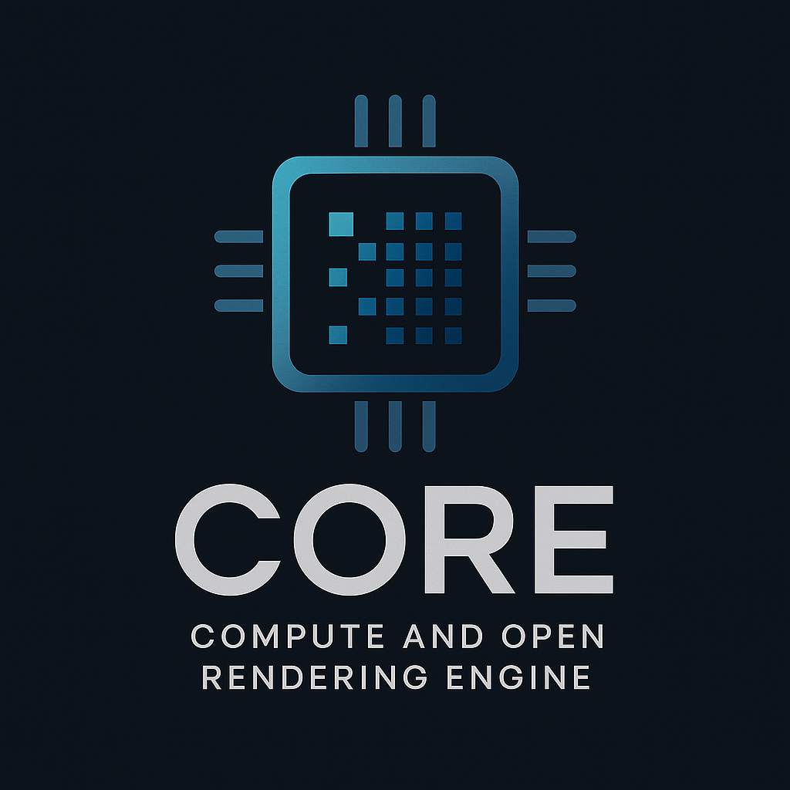

# CORE: Compute and Open Rendering Engine

<p align="center">
  
</p>

# 1. Supporting OS

- MacOS
- Android arm64-v8a

# 2. Unit Tests
```
./run.sh [-target macos|arm64-v8a] [-test_module <name>] [-test_filter <Suite.Test>]
```

vulkan module:
1. ./run.sh -target macos -test_module vulkan -test_filter ComputeSum.test
2. ./run.sh -target arm64-v8a -test_module vulkan -test_filter ComputeSum.test

tests module
1. ./run.sh -target macos -test_module tests -test_filter StbTest.test
2. ./run.sh -target arm64-v8a -test_module tests -test_filter StbTest.test